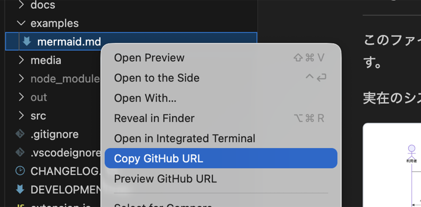

# Copy GitHub URL

[](https://marketplace.visualstudio.com/items?itemName=ascreit.vscode-copy-github-url)
[](https://marketplace.visualstudio.com/items?itemName=ascreit.vscode-copy-github-url)
[](https://marketplace.visualstudio.com/items?itemName=ascreit.vscode-copy-github-url)
[](LICENSE)

VS Code / Cursor のエクスプローラーやエディターの右クリックメニューから、現在のファイルのGitHub URLをコピーするための拡張です。

GitHubで管理されているリポジトリ内のファイルを右クリックして `Copy GitHub URL` を実行すると、以下のようなURLをクリップボードへコピーします。

```text
https://github.com/ascreit/vscode-copy-github-url/blob/main/README.md
```

## できること

- エクスプローラーでファイルを右クリックしてGitHub URLをコピー
- エディターで開いているファイルからGitHub URLをコピー
- 生成したGitHub URLをブラウザで開いてプレビュー
- Gitのremote URLと現在のブランチ名からGitHubの `blob` URLを生成
- GitHubリポジトリではない場合やremoteが見つからない場合に通知

## スクリーンショット

エクスプローラーやエディターの右クリックメニューから、`Copy GitHub URL` と `Preview GitHub URL` を実行できます。



## 使い方

1. GitHubで管理されているリポジトリをVS Code / Cursorで開く
2. エクスプローラー、またはエディター上でファイルを右クリックする
3. `Copy GitHub URL` を押す
4. 生成されたGitHub URLがクリップボードへコピーされます

ブラウザで開く場合は、右クリックメニューまたはコマンドパレットから `Preview GitHub URL` を実行します。

コマンドパレットから実行する場合は、以下のコマンドを使います。

```text
Copy GitHub URL
Preview GitHub URL
```

例えば、`main` ブランチで `examples/mermaid.md` をコピーした場合は以下のようなURLになります。

```text
https://github.com/ascreit/vscode-github-markdown-preview/blob/main/examples/mermaid.md
```

## インストール

Marketplaceで公開後、以下からインストールできます。

```text
Copy GitHub URL
```

拡張IDで検索する場合は以下です。

```text
ascreit.vscode-copy-github-url
```
